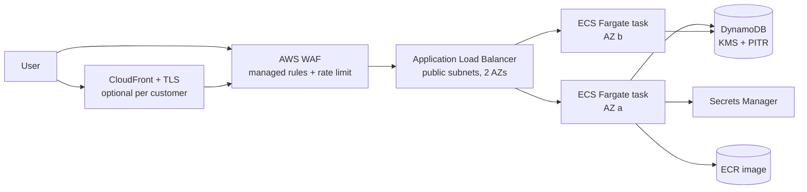
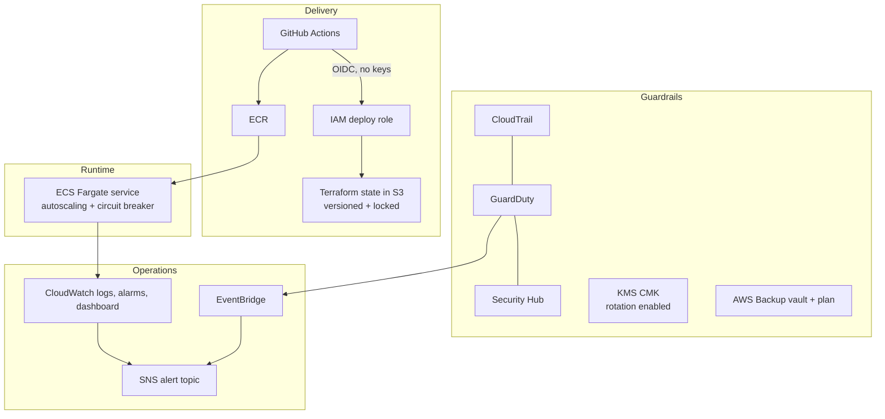

# Architecture

## Design goals

| Goal | How it is met |
|---|---|
| Reusable across customers | One root module (`stack/`), one tfvars file per customer environment |
| No customer specifics in code | Account ID from `aws_caller_identity`, region and names from variables |
| Predictable sizing | `small` / `medium` / `large` profiles in `stack/locals.tf` |
| Secure by default | Private-by-design SGs, KMS everywhere, WAF, GuardDuty, no static keys |
| Low operational load | Fargate, DynamoDB on-demand, managed autoscaling, AWS Backup |

## Request path

## Platform services

## Alignment with AWS SMB solution patterns

| AWS pattern | Implementation here |
|---|---|
| Website & App Hosting | CloudFront, WAF, ALB, ECS Fargate, ECR, DynamoDB |
| Secure Landing Zone | Dedicated VPC per customer environment, CloudTrail, KMS CMK, IAM roles only, OIDC federation, no long-lived keys |
| Infrastructure Threat Detection | GuardDuty, Security Hub FSBP standard, VPC flow logs, EventBridge routing findings to the on-call topic |
| Cloud Backup | AWS Backup vault, tag-driven selection, daily plan with lifecycle, DynamoDB PITR |

## Key decisions and trade-offs

**ECS Fargate over EC2 or EKS.** A small engineering team should not run nodes or a control plane. Fargate removes patching and capacity management. EKS was rejected as too much operational surface for this customer size; Lambda was rejected because the customer runs a conventional web/API container.

**DynamoDB over RDS for the reference app.** No idle instance cost, no failover to operate, backups and PITR are managed. Where a customer needs relational features, the `data` module is replaced with an RDS module and nothing else in the stack changes.

**NAT gateway is a sizing decision, not a default.** A NAT gateway costs roughly the same per month as the entire small environment. `small` runs tasks in public subnets with a public IP but *no* inbound path: the task security group only accepts traffic from the ALB security group. `medium` and `large` enable NAT and move tasks into private subnets.

**Regional WAF on the ALB rather than only on CloudFront.** The origin is protected whether or not a customer has CloudFront enabled. When CloudFront is enabled, the ALB rejects any request that does not carry the secret origin header, so the edge cannot be bypassed.

**Fargate Spot for non-production.** Roughly 70% cheaper, and an interrupted dev task is not an incident.

**Terraform state.** One S3 bucket, versioned, encrypted, TLS-only, with native state locking. One state key per customer environment, so a mistake in one customer cannot affect another.

## What changes per customer

Only `customers/<customer>/<env>.tfvars` and the state key. Region, size, CIDR, WAF, CloudFront, backup retention and alert address are all configuration.
